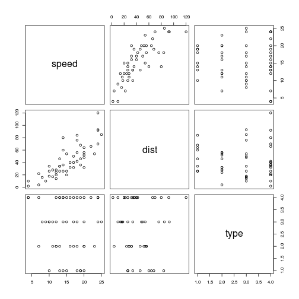
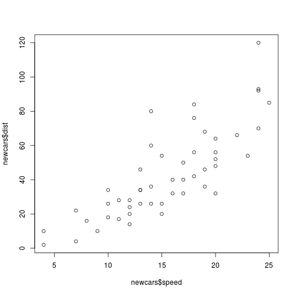
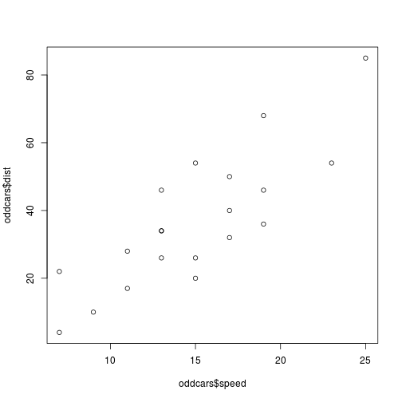

## This Workshop
The primary goal of this workshop is to make sure that all attendees
(new and prior) have a baseline background that can be built upon in future workshops.

Visit [github.com/nmsdataskills/r_basics](https://github.com/nmsdataskills/) to find the latest version of this guide.
You can download the RMarkdown (`.Rmd`) file to play with in RStudio,
or just download the HTML version of the guide if you only want to read along.
You'll also want the data to follow along throughout the workshop.

The files are all pretty small, so you might be happiest downloading the entire "Guides" repository.

See Resources (at bottom) for links to various things we recommend reading or watching.

Topics:

- Loading Data
    * Filepaths
    * Headers
- Data At A Glance
    * Visualization With `plot`
- Basic Data Manipulation And Cleaning
    * Understanding Boolean Expressions
    * The `subset` Command
    * Factors
- Generating Mock Data With Random Numbers *(if time allows)*
    * Creating The `newcars` Data Set

## North Mississippi Data Skills
We provide accessible training in professional, open-source data workflows and best practices to researchers from various backgrounds.

Our workshops are designed for students with research projects in mind.
We assume that your program of study involves some statistical preparation relevant to your research.
From experience, we also assume that your instructor had to cover a lot statistics,
and only had so much time to cover professional tools.
That's where we hope to be of assistance!

Where to find us:

- Hang out with us at [nmsdataskills.slack.com](http://nmsdataskills.slack.com). Currently, anyone with an msstate.edu email address can join the Slack team.
- Access our content at [github.com/nmsdataskills](http://github.com/nmsdataskills). We're happy to have contributions.

## Thanks!
We'd like to thank the MSU Mitchell Memorial Library and the MSU Instructional Media Center
for providing us with this meeting space.

In addition, many thanks are owed to those attendees who have patiently attended the early workshops,
reviewed materials, and provided valuable feedback. Your support is very much appreciated!

## Loading Data
First, it's a good idea to tell R where we're working.
To do so, we use the `setwd` command, which is short for "set working directory."

```r
setwd("~/work/nmsds/guides/R_intro/")
```

```
## Error in setwd("~/work/nmsds/guides/R_intro/"): cannot change working directory
```

Now, we can load our data:

```r
newcars = read.table("newcars.txt")
```

The use of `setwd` can be avoided by giving the full path to `newcars.txt`, like so:

```r
newcars = read.table("~/work/nmsds/guides/R_intro/newcars.txt")
```

However, this causes repeated work when accessing the same directory over and over.

### Filepaths
On any platform, R adheres to the Unix format of delimiting directories in a pathname by forward slashes - like this `/`, not like this `\`.

This might confuse Windows users, whose filepaths usually look something like `C:\Users\ben\work\nmsds\guides\R_intro`. To use this filepath in R, you would enter

```r
setwd("C:/Users/ben/work/nmsds/guides/R_intro/")
```

### Headers
Files may or may not have a row at the top identifying each column by name.
These rows are called "headers."
By default, R assumes that data from a `.txt` file will not have a header,
and that data from any other file opened with `read.<filetype>` will have a header.
Perhaps it's easier to show this with code.


```r
data = read.table("filename.txt") # Assumes no header
data = read.table("filename.txt", header=TRUE) # Explicitly tell R to use a header
data = read.csv("filename.csv") # Assumes a header
data = read.csv("filename.csv", header=FALSE) # Uses first row as data
```

However, the documentation states the following:

> If missing, the value is determined from the file format: header is set to TRUE if and only if the first row contains one fewer field than the number of columns.

This means that, if you do not provide a value for the `header` parameter,
R will look to see if you have an index column.
This would be the case if you had saved dataframe.
However, if you are loading data for the first time, you may not have an index column yet.
Suppose `simple.txt` looked like this:
```
a b c
1 2 3
4 5 6
```

If you ran `simple = read.table('simple.txt')` without specifying a header, you'd end up with this data frame:
```
  V1 V2 V3
1  a  b  c
2  1  2  3
3  4  5  6
```

Because R coerces data to the most flexible data type involved in an operation (such as creating a vector,)
the integers are treated as strings.
Then, because R loads strings as factors (discussed below) by default, we end up with three different factor columns.
This is almost certainly not what we wanted.

In general, the factor issue can be avoided with `simple = read.table('simple.txt', stringsAsFactors=FALSE)`,
but specifying `header=TRUE` will handle this particular issue.

For more information on these functions, see the 
[Data Input](https://stat.ethz.ch/R-manual/R-devel/library/utils/html/read.table.html)
page in the R manual.

## Data At A Glance
Once a dataframe exists in R, it can be printed to the screen simply by evaluating its name.
However, we'd rather not print out all 50 records. Instead, we'll use the `head()` function.

```r
head(newcars)
```

```
##   speed dist type
## 1     4    2    4
## 2     4   10    4
## 3     7    4    2
## 4     7   22    4
## 5     8   16    3
## 6     9   10    3
```

Get the number of rows in a dataframe:

```r
n = nrow(newcars)
```


```r
summary(newcars)
```

```
##      speed           dist             type     
##  Min.   : 4.0   Min.   :  2.00   Min.   :1.00  
##  1st Qu.:12.0   1st Qu.: 26.00   1st Qu.:2.00  
##  Median :15.0   Median : 36.00   Median :3.00  
##  Mean   :15.4   Mean   : 42.98   Mean   :2.82  
##  3rd Qu.:19.0   3rd Qu.: 56.00   3rd Qu.:4.00  
##  Max.   :25.0   Max.   :120.00   Max.   :4.00
```

R has built-in functions for obtaining the names of the rows and columns of a dataframe.
Usually, rows will be identified by an integer index.

```r
colnames(newcars)
```

```
## [1] "speed" "dist"  "type"
```

```r
rownames(newcars)
```

```
##  [1] "1"  "2"  "3"  "4"  "5"  "6"  "7"  "8"  "9"  "10" "11" "12" "13" "14"
## [15] "15" "16" "17" "18" "19" "20" "21" "22" "23" "24" "25" "26" "27" "28"
## [29] "29" "30" "31" "32" "33" "34" "35" "36" "37" "38" "39" "40" "41" "42"
## [43] "43" "44" "45" "46" "47" "48" "49" "50"
```

### Visualization With The `plot` Command
The `newcars` data comes from the `cars` data set that is distributed with R.
`cars` only has the `speed` and `dist` columns available in `newcars`.


```r
plot(cars)
```



If we only pass the name of the `newcars` data frame to plot,
then we actually get a matrix of scatterplots.

```r
plot(newcars)
```



To obtain a plot similar to the first for `newcars`, we can specify the `x` and `y` parameters to `plot`.

```r
plot(newcars$speed, newcars$dist)
```


This seems inconsistent at first glance, but it helps to know what R is doing. Under the hood, R actually calls different "methods" named `plot` that belong to different kinds of "objects" in the language. In this case, we first call the `plot` method of a dataframe, and then we call the `plot` function that simply takes an `x` and a `y` value.

## Basic Data Manipulation and Cleaning
### Understanding Boolean Expressions
From Wikipedia:

> ...a Boolean expression is an expression in a programming language that produces a Boolean value when evaluated, i.e. one of **true** or **false**.

In R, we write these values as `TRUE` and `FALSE`, respectively.
For example, we might wish to know if a particular value is an even integer:

```r
x = 5
x %% 2
```

```
## [1] 1
```

```r
x %% 2 == 0
```

```
## [1] FALSE
```

### Subset
Select only cars with odd speeds:

```r
oddcars = subset(newcars, newcars$speed %% 2 == 1)
head(oddcars)
```

```
##    speed dist type
## 3      7    4    2
## 4      7   22    4
## 6      9   10    3
## 10    11   17    3
## 11    11   28    2
## 16    13   26    4
```

```r
summary(oddcars)
```

```
##      speed           dist           type     
##  Min.   : 7.0   Min.   : 4.0   Min.   :1.00  
##  1st Qu.:12.5   1st Qu.:25.0   1st Qu.:2.00  
##  Median :15.0   Median :34.0   Median :3.00  
##  Mean   :14.9   Mean   :36.6   Mean   :2.65  
##  3rd Qu.:17.5   3rd Qu.:47.0   3rd Qu.:4.00  
##  Max.   :25.0   Max.   :85.0   Max.   :4.00
```

```r
plot(oddcars$speed, oddcars$dist)
```



Select only the columns `type` and `speed` for cars with even speeds:

```r
evenspeeds = subset(newcars, newcars$speed %% 2 == 0, select=c(type, speed))
head(evenspeeds)
```

```
##   type speed
## 1    4     4
## 2    4     4
## 5    3     8
## 7    3    10
## 8    1    10
## 9    3    10
```

### Factors
In R, we can use **factors** to handle categorical data.
We have a field in `newcars` called `type` for which each row has a value of either 1, 2, 3, or 4.
However, we'd like to let R know that this is categorical data instead of numerical data.
Suppose we wished to divide the built-in `cars` data set into four types,
sedan, truck, van, and station wagon, which we label as 1, 2, 3, and 4, respectively.

```r
set.seed(42)
newcars$type = as.factor(newcars$type)
table(head(newcars))
```

We'll be covering factors, along with other ways to access and manipulate your data,
in more detail in an upcoming workshop about R's data structures.

## Generating Mock Data With Random Numbers
Don't have your data yet? Not a problem!

R has some nice commands for generating random data. For example:

```r
set.seed(1) # Get rid of this to get a new data set each time.
runif(4, min=-1, max=1) # Generate 4 random floating point numbers between -1 and 1.
```

```
## [1] -0.4689827 -0.2557522  0.1457067  0.8164156
```

```r
rnorm(3) # Generate 3 floating point numbers from the N(0,1) distribution
```

```
## [1] -0.8356286  1.5952808  0.3295078
```

```r
rnorm(5, mean=70, sd=10) # Generate 5 floating point numbers from the N(70,10) distribution
```

```
## [1] 61.79532 74.87429 77.38325 75.75781 66.94612
```

```r
sample(1:10, 4) # Generate 4 integers between 1 and 10 without replacement
```

```
## [1] 10  2  6  1
```

So, why would we do this?

- You can write code prior to receiving your data, which is important if your analysis is time-sensitive or if your data set is updated over time.
- You think about the possible values your observations could take on. What does it mean for an observation to be zero valued? Negative?
- By designing in advance, you're restraining yourself from designing your analysis to suit your data. Generally, we'd like to design an analysis in advance, then arrange for data to be collected in a manner that ensures the assumptions of our analysis will be met.

So, the goal is not to make inferences about the data,
but to make sure that our code can handle the format of the data we expect.


### Creating The `newcars` Data Set
This is how the `newcars` data set was generated from the "cars" data set
that is distributed with R.


```r
set.seed(42)
newcars = cars
newcars$type = sample(1:4, nrow(newcars), replace=TRUE)

write.csv(newcars, file="newcars.csv")
write.table(newcars, file="newcars.txt")
```

Notice that it wasn't necessary to specify a full file path when writing my data to each file.
The directory specified above with `setwd` was used.
If the files need to be stored outside of the current working directory,
`write.csv` and `write.table` both work fine with full pathnames:

```r
write.csv(newcars, file="~work/nmsds/guides/fake-directory/newcars.csv")
```

## Resources
The first place you should look for anything R-related is the
[Awesome R](https://github.com/qinwf/awesome-R) collection.
For similar lists, see [Awesome Awesomeness](https://github.com/bayandin/awesome-awesomeness).

### Getting Set Up
You can learn about installing R at [CRAN](https://cran.r-project.org/) - the Comprehensive R Archive Network. This presentation was made using
[RStudio Desktop](https://www.rstudio.com/products/rstudio-desktop/)
and RMarkdown.

If you're interested in RMarkdown, note that the Pandoc implementation of markdown is used, [as documented here](http://rmarkdown.rstudio.com/authoring_pandoc_markdown.html).

RStudio makes [great reference cards](https://www.rstudio.com/resources/cheatsheets/)
for their products. You might be interested in:

- [Using RStudio](http://www.rstudio.com/wp-content/uploads/2016/01/rstudio-IDE-cheatsheet.pdf)
- [RMarkdown Reference](http://www.rstudio.com/wp-content/uploads/2015/02/rmarkdown-cheatsheet.pdf)
- [RMarkdown Cheat Sheet](https://www.rstudio.com/wp-content/uploads/2015/02/rmarkdown-cheatsheet.pdf)
- [Data Wrangling with dplyr and tidyr](http://www.rstudio.com/wp-content/uploads/2015/02/data-wrangling-cheatsheet.pdf)
- [Visualization with ggplot2](http://www.rstudio.com/wp-content/uploads/2015/12/ggplot2-cheatsheet-2.0.pdf)

### Learning R
NMSDS be preparing additional workshops on the subject over the next month, so stay tuned.

If you already have some experience with R or another language,
you can check out the latest version of Hadley Wickham's book,
[Advanced R](http://adv-r.had.co.nz/), for free online!

For a quick overview, you might like the Learn X in Y Minutes project, which has [an entry on R](https://learnxinyminutes.com/docs/r/).

CodeSchool has some great introductory lessons to things like Git and web development. They're picking up on some other topics, too, [like R](http://tryr.codeschool.com/)!

[Datacamp](https://www.datacamp.com/) is supposed to be pretty good. I can't say I've tried it.

CRAN provides a [reference card](https://cran.r-project.org/doc/contrib/Short-refcard.pdf)
for the R language.

Of course, you could always just Google "R MOOC"...
